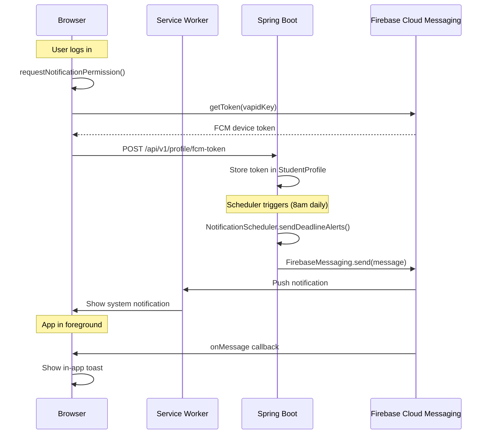

# 🔔 Completing Firebase Notifications in ScholarLink

## Current Status — What's Already Done ✅

Your backend notification infrastructure is **already well-built**. Here's what exists:

| Component | File | Status |
|---|---|---|
| Firebase Admin SDK dependency | [pom.xml](file:///C:/Users/Administrator/Desktop/Scholarlink/backend/pom.xml#L134-L139) | ✅ `firebase-admin:9.2.0` |
| Firebase initialization | [FirebaseConfig.java](file:///C:/Users/Administrator/Desktop/Scholarlink/backend/src/main/java/com/scholarlinkgh/config/FirebaseConfig.java) | ✅ Reads service account key |
| Notification service | [NotificationService.java](file:///C:/Users/Administrator/Desktop/Scholarlink/backend/src/main/java/com/scholarlinkgh/service/NotificationService.java) | ✅ Sends deadline, match, digest, custom notifications |
| Scheduler | [NotificationScheduler.java](file:///C:/Users/Administrator/Desktop/Scholarlink/backend/src/main/java/com/scholarlinkgh/config/NotificationScheduler.java) | ✅ Daily deadline alerts + weekly digest |
| FCM token storage | [StudentProfile.java](file:///C:/Users/Administrator/Desktop/Scholarlink/backend/src/main/java/com/scholarlinkgh/entity/StudentProfile.java#L101-L102) | ✅ `fcmToken` column |
| FCM token registration API | [ProfileController.java](file:///C:/Users/Administrator/Desktop/Scholarlink/backend/src/main/java/com/scholarlinkgh/controller/ProfileController.java#L125-L146) | ✅ `POST /api/v1/profile/fcm-token` |
| Deadline tracking | [ApplicationTracker.java](file:///C:/Users/Administrator/Desktop/Scholarlink/backend/src/main/java/com/scholarlinkgh/entity/ApplicationTracker.java#L87-L89) | ✅ `deadlineRemindersSent` field |
| Application properties | [application.properties](file:///C:/Users/Administrator/Desktop/Scholarlink/backend/src/main/resources/application.properties#L43-L45) | ✅ `firebase.*` env vars wired |

---

## What's Missing — Steps to Complete 🔧

### Step 1: Create a Firebase Project & Get Service Account Key

1. Go to [Firebase Console](https://console.firebase.google.com/)
2. Click **"Add project"** → name it (e.g., `scholarlink-gh`)
3. Enable **Google Analytics** if you want (optional)
4. Once created, go to **Project Settings** (gear icon) → **Service Accounts**
5. Click **"Generate new private key"** → download the JSON file
6. Save it somewhere **outside your git repo**, e.g.:
   ```
   C:\Users\Administrator\secrets\firebase-service-account.json
   ```

> [!CAUTION]
> **Never commit the service account JSON to git.** It contains private keys. Your `.gitignore` should already exclude `.env` and JSON keys.

### Step 2: Configure Environment Variables

Add to your backend `.env` file:

```env
# ── Firebase FCM (Push Notifications) ─────────────────────────────────
FIREBASE_SERVICE_ACCOUNT_KEY_PATH=C:/Users/Administrator/secrets/firebase-service-account.json
FIREBASE_PROJECT_ID=scholarlink-gh
```

> [!NOTE]
> Use forward slashes in the path even on Windows — Java handles them correctly.

### Step 3: Enable Cloud Messaging in Firebase Console

1. In Firebase Console → your project → **Cloud Messaging** (left sidebar)
2. If prompted, enable the **Firebase Cloud Messaging API (V1)** — this is the modern API your SDK uses

### Step 4: Set Up Firebase on the Frontend (Client-Side)

This is the **critical missing piece**. Your frontend needs to:
1. Initialize Firebase
2. Request notification permissions from the browser
3. Get the FCM device token
4. Send it to your backend via `POST /api/v1/profile/fcm-token`
5. Handle incoming foreground notifications
6. Register a service worker for background notifications

#### 4a. Install Firebase JS SDK

```bash
npm install firebase
```

#### 4b. Create Firebase Config File

Create `src/firebase.js` (or `src/lib/firebase.js`):

```javascript
import { initializeApp } from 'firebase/app';
import { getMessaging, getToken, onMessage } from 'firebase/messaging';

// Get these values from Firebase Console → Project Settings → General → Your apps → Web app
const firebaseConfig = {
  apiKey: "YOUR_API_KEY",
  authDomain: "scholarlink-gh.firebaseapp.com",
  projectId: "scholarlink-gh",
  storageBucket: "scholarlink-gh.appspot.com",
  messagingSenderId: "YOUR_SENDER_ID",
  appId: "YOUR_APP_ID"
};

const app = initializeApp(firebaseConfig);
const messaging = getMessaging(app);

/**
 * Requests notification permission and returns the FCM token.
 * Returns null if the user denies permission.
 */
export async function requestNotificationPermission() {
  try {
    const permission = await Notification.requestPermission();
    if (permission !== 'granted') {
      console.warn('Notification permission denied');
      return null;
    }

    // Get FCM token — requires your VAPID key from Firebase Console
    // Firebase Console → Project Settings → Cloud Messaging → Web Push certificates
    const token = await getToken(messaging, {
      vapidKey: 'YOUR_VAPID_KEY'
    });

    console.log('FCM Token:', token);
    return token;
  } catch (error) {
    console.error('Error getting FCM token:', error);
    return null;
  }
}

/**
 * Registers the FCM token with the backend.
 */
export async function registerFcmToken(jwtToken) {
  const fcmToken = await requestNotificationPermission();
  if (!fcmToken) return false;

  try {
    const response = await fetch('/api/v1/profile/fcm-token', {
      method: 'POST',
      headers: {
        'Content-Type': 'application/json',
        'Authorization': `Bearer ${jwtToken}`
      },
      body: JSON.stringify({ token: fcmToken })
    });

    const data = await response.json();
    return data.success;
  } catch (error) {
    console.error('Failed to register FCM token:', error);
    return false;
  }
}

/**
 * Listens for foreground notifications and shows them.
 */
export function onForegroundMessage(callback) {
  onMessage(messaging, (payload) => {
    console.log('Foreground message received:', payload);
    callback(payload);
  });
}

export { messaging };
```

#### 4c. Create Service Worker for Background Notifications

Create `public/firebase-messaging-sw.js` at your **web root**:

```javascript
/* eslint-disable no-undef */
importScripts('https://www.gstatic.com/firebasejs/10.12.0/firebase-app-compat.js');
importScripts('https://www.gstatic.com/firebasejs/10.12.0/firebase-messaging-compat.js');

firebase.initializeApp({
  apiKey: "YOUR_API_KEY",
  authDomain: "scholarlink-gh.firebaseapp.com",
  projectId: "scholarlink-gh",
  storageBucket: "scholarlink-gh.appspot.com",
  messagingSenderId: "YOUR_SENDER_ID",
  appId: "YOUR_APP_ID"
});

const messaging = firebase.messaging();

// Handle background messages
messaging.onBackgroundMessage((payload) => {
  console.log('Background message received:', payload);

  const notificationTitle = payload.notification?.title || 'ScholarLink';
  const notificationOptions = {
    body: payload.notification?.body || '',
    icon: '/favicon.ico',
    badge: '/favicon.ico',
    data: payload.data,
    // Deep link to the relevant page based on notification type
    actions: getActions(payload.data?.type)
  };

  self.registration.showNotification(notificationTitle, notificationOptions);
});

// Handle notification click — open the app
self.addEventListener('notificationclick', (event) => {
  event.notification.close();

  const data = event.notification.data;
  let url = '/';

  // Route to the right page based on notification type
  if (data?.type === 'DEADLINE_ALERT' && data?.entity_id) {
    url = `/scholarships/${data.entity_id}`;
  } else if (data?.type === 'NEW_MATCH' && data?.entity_id) {
    url = `/scholarships/${data.entity_id}`;
  } else if (data?.type === 'WEEKLY_DIGEST') {
    url = '/dashboard';
  }

  event.waitUntil(
    clients.matchAll({ type: 'window', includeUncontrolled: true }).then((clientList) => {
      // Focus existing window or open new one
      for (const client of clientList) {
        if (client.url.includes(url) && 'focus' in client) {
          return client.focus();
        }
      }
      return clients.openWindow(url);
    })
  );
});

function getActions(type) {
  switch (type) {
    case 'DEADLINE_ALERT':
      return [{ action: 'view', title: 'View Scholarship' }];
    case 'NEW_MATCH':
      return [{ action: 'view', title: 'Check It Out' }];
    case 'WEEKLY_DIGEST':
      return [{ action: 'view', title: 'View Dashboard' }];
    default:
      return [];
  }
}
```

#### 4d. Integrate in Your App (call after login)

```javascript
import { registerFcmToken, onForegroundMessage } from './firebase';

// Call this after the user logs in successfully
async function onLoginSuccess(jwtToken) {
  // Register FCM token with backend
  await registerFcmToken(jwtToken);

  // Listen for foreground messages
  onForegroundMessage((payload) => {
    // Show an in-app toast/notification
    showToast({
      title: payload.notification.title,
      message: payload.notification.body,
      type: payload.data?.type
    });
  });
}
```

---

### Step 5: Get Your Firebase Web App Credentials

1. Firebase Console → **Project Settings** → **General**
2. Scroll to **"Your apps"** → click **"Add app"** → choose **Web** (`</>`)
3. Register the app → copy the `firebaseConfig` object
4. For the **VAPID key**: Project Settings → **Cloud Messaging** → **Web Push certificates** → **Generate key pair**

---

## Architecture Diagram



---

## Checklist

- [ ] Create Firebase project at console.firebase.google.com
- [ ] Download service account key JSON
- [ ] Set `FIREBASE_SERVICE_ACCOUNT_KEY_PATH` and `FIREBASE_PROJECT_ID` in `.env`
- [ ] Enable Cloud Messaging API (V1) in Firebase Console
- [ ] Register a Web app in Firebase to get `firebaseConfig` values
- [ ] Generate a VAPID key for web push
- [ ] Install `firebase` npm package in frontend
- [ ] Create `src/firebase.js` with token request logic
- [ ] Create `public/firebase-messaging-sw.js` service worker
- [ ] Call `registerFcmToken()` after user login
- [ ] Handle foreground messages with `onForegroundMessage()`
- [ ] Test end-to-end with a real device/browser

> [!TIP]
> You can test FCM without a full frontend by using the **Firebase Console → Cloud Messaging → Send test message** feature. Enter an FCM token manually and send a test notification to verify your backend setup works.
